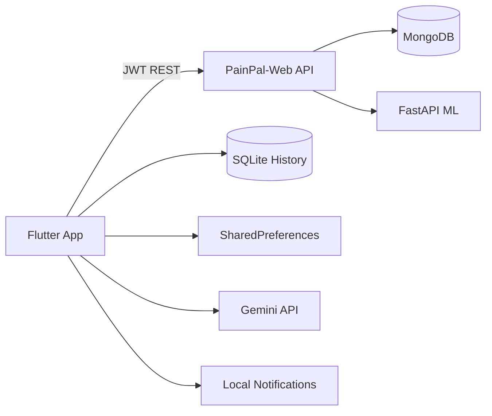

# PainPal Mobile App

[](https://github.com/YOUR_ORG/PainPal-MobileApp/actions/workflows/ci.yml)
[](LICENSE)
[](https://github.com/YOUR_ORG/PainPal-MobileApp/releases)
[](https://github.com/YOUR_ORG/PainPal-MobileApp/graphs/contributors)
[](https://github.com/YOUR_ORG/PainPal-MobileApp/issues)

**Flutter patient app for migraine tracking, analytics, and AI-assisted support.**

> **Requires backend:** [PainPal-Web](https://github.com/YOUR_ORG/PainPal-Web) — Next.js API + ML model service  
> **Full platform docs:** [PainPal-Web/docs](https://github.com/YOUR_ORG/PainPal-Web/tree/main/docs)

---

## Features

- Structured migraine attack logging with ML classification
- Brain MRI upload and educational analysis
- Offline history (SQLite) with cloud sync via JWT API
- Analytics dashboard — trends, triggers, medication effectiveness
- Medication schedule reminders (local notifications)
- Gemini AI chat assistant with voice input/output
- Doctor–patient messaging
- Secure login and token refresh

> **Medical disclaimer:** For education and self-tracking only. Not a medical device.

---

## Screenshots

| Overview | Log Attack | Analytics |
|----------|------------|-----------|
|  |  |  |

| MRI Upload | History | Settings |
|------------|---------|----------|
|  |  |  |

_Add PNGs under `assets/screenshots/`._

---

## Quick Start

### Prerequisites

- Flutter 3.11+ / Dart 3.11+
- Running [PainPal-Web](https://github.com/YOUR_ORG/PainPal-Web) API (`npm run dev` in `client/`)
- Gemini API key ([Google AI Studio](https://aistudio.google.com/app/apikey))

### Setup

```bash
git clone https://github.com/YOUR_ORG/PainPal-MobileApp.git
cd PainPal-MobileApp
cp .env.example .env
# Edit .env: GEMINI_API_KEY, API_BASE_URL=http://127.0.0.1:3000
flutter pub get
flutter run
```

**Android emulator:** use `API_BASE_URL=http://10.0.2.2:3000`

Detailed guide: [docs/mobile-setup.md](docs/mobile-setup.md)

---

## Environment Variables

| Variable | Required | Description |
|----------|----------|-------------|
| `GEMINI_API_KEY` | Yes (chat) | Google Gemini API key |
| `API_BASE_URL` | Yes | PainPal-Web API origin (no trailing slash) |

You can override `API_BASE_URL` in app **Settings** without rebuilding.

---

## Architecture



Details: [docs/architecture-mobile.md](docs/architecture-mobile.md) · Platform: [Web docs](https://github.com/YOUR_ORG/PainPal-Web/blob/main/docs/architecture.md)

---

## Tech Stack

| Category | Packages |
|----------|----------|
| Framework | Flutter, Dart 3.11 |
| HTTP | `http` |
| Storage | `sqflite`, `shared_preferences`, `path_provider` |
| AI | `google_generative_ai` (Gemini 2.0 Flash) |
| Voice | `flutter_tts`, Android MethodChannel |
| Notifications | `flutter_local_notifications`, `timezone` |
| Media | `image_picker` |

---

## Project Structure

```
lib/
├── main.dart                 # Entry, .env load, AppServices init
├── screens/                  # Auth + 6-tab home shell
├── data/                     # API clients, auth, SQLite, models
├── services/                 # Medication reminders, app services
├── widgets/                  # Charts, chat FAB, reusable UI
└── util/                     # API origin helpers (Android loopback)

test/                         # Unit, integration, UAT tests
docs/                         # Mobile documentation
```

---

## Running Tests

```bash
flutter analyze
flutter test
```

---

## Backend Integration

| Endpoint | Purpose |
|----------|---------|
| `POST /api/auth/login` | Authentication |
| `POST /api/summary` | Migraine classification |
| `POST /api/mri/predict` | MRI analysis |
| `GET /api/patient/analytics` | Analytics data |
| `GET /api/patient/medication-schedule` | Reminder sync |

Full API reference: [PainPal-Web/docs/api.md](https://github.com/YOUR_ORG/PainPal-Web/blob/main/docs/api.md)

---

## Contributing

See [CONTRIBUTING.md](CONTRIBUTING.md). Platform-wide guide: [PainPal-Web/docs/contributing.md](https://github.com/YOUR_ORG/PainPal-Web/blob/main/docs/contributing.md).

---

## Roadmap

Synced with [PainPal-Web/ROADMAP.md](https://github.com/YOUR_ORG/PainPal-Web/blob/main/ROADMAP.md). Mobile-specific: [ROADMAP.md](ROADMAP.md)

---

## License

[MIT License](LICENSE)

---

## Support

- [FAQ](https://github.com/YOUR_ORG/PainPal-Web/blob/main/docs/faq.md)
- [GitHub Issues](https://github.com/YOUR_ORG/PainPal-MobileApp/issues)
- [Security](SECURITY.md)

**Replace `YOUR_ORG` with your GitHub organization before publishing.**
