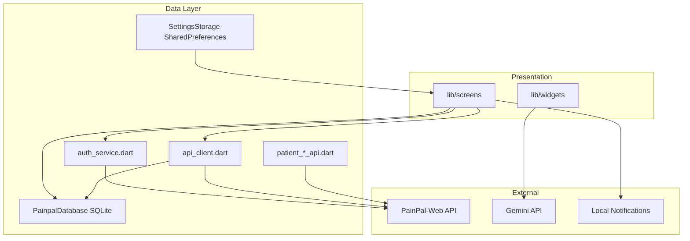

# Mobile Architecture

## Overview

The PainPal mobile app is a Flutter patient client that talks to the PainPal-Web Next.js API. It caches data locally in SQLite for offline history review.



Platform architecture: [PainPal-Web/docs/architecture.md](https://github.com/YOUR_ORG/PainPal-Web/blob/main/docs/architecture.md)

## Entry Point

`lib/main.dart`:

1. Loads `.env` via `flutter_dotenv`
2. Initializes `AppServices` (auth singleton)
3. Launches `SessionShell` (auth gate)

## Navigation

```
SessionShell
├── LandingScreen / LoginScreen (signed out)
└── HomeScreen (signed in, 6 tabs)
    ├── Tab 0: LogAttackScreen (overview/analytics dashboard)
    ├── Tab 1: MigraineFormScreen
    ├── Tab 2: MriUploadScreen
    ├── Tab 3: HistoryScreen
    ├── Tab 4: AnalyticsScreen
    ├── Tab 5: SettingsScreen
    └── FAB: ChatAssistant (Gemini)
```

## Data Layer (`lib/data/`)

| Module | Responsibility |
|--------|----------------|
| `auth_service.dart` | Login, register, JWT, refresh, API base URL resolution |
| `backend_config.dart` | Endpoint path constants |
| `api_client.dart` | Migraine summary + MRI predict |
| `patient_remote_api.dart` | Remote history lists |
| `patient_analytics_api.dart` | Analytics + AI summary |
| `doctor_patient_chat_api.dart` | Messaging |
| `database.dart` | SQLite schema and CRUD |
| `storage.dart` | Settings, drafts, preferences |
| `gemini_ai_service.dart` | Gemini chat |
| `ai_config.dart` | Gemini key from `.env` |
| `models.dart` | DTOs and domain models |

## API Base URL Resolution

Order (see `auth_service.dart`):

1. Settings screen value (SharedPreferences)
2. `.env` → `API_BASE_URL`
3. Fallback `http://localhost:3000`

Android emulator loopback handled in `lib/util/api_origin.dart`.

## Local Storage

| Store | Contents |
|-------|----------|
| SQLite (`painpal.db`) | Migraine attacks, MRI scans |
| SharedPreferences | API URL, patient ID, form drafts, chat doctor ID |

## Services (`lib/services/`)

- `app_services.dart` — global service locator
- `medication_reminder_service.dart` — syncs schedule from API, schedules local notifications

## Testing

```
test/
├── auth_service_test.dart
├── api_origin_test.dart
├── integration/
└── uat/
```

Run: `flutter test`

## Key Dependencies

See `pubspec.yaml`. Primary: `http`, `sqflite`, `shared_preferences`, `google_generative_ai`, `flutter_local_notifications`.

## Planned Improvements (v1.5)

- Generated API client from OpenAPI
- Push notifications via FCM
- Clean up unused dependencies
- Rename Android package ID to `com.painpal.app`
